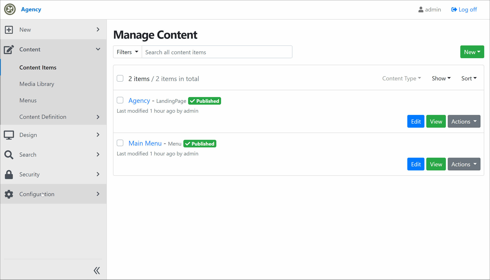

# Device Preview - Surevelox.OrchardCore.DevicePreview


## Install

Add `Surevelox.OrchardCore.DevicePreview` to your OrchardCore Web project


```bash

dotnet add package Surevelox.OrchardCore.DevicePreview

```


## Enable Feature 

Include in your Recipe to enable the feature by default


```json
"steps": [
    {
      "name": "feature",
      "enable": [
        "Surevelox.OrchardCore.DevicePreview"
      ]
    }
 ]
```

Or use Menu `Admin - Setup - Features` in Admin UI and search for `Device Preview` and click `Enable`.



## Like?  Support Us.

Like the Device Preview module? Support us by sponsoring  [Surevelox @ Github](https://github.com/sponsors/surevelox).  