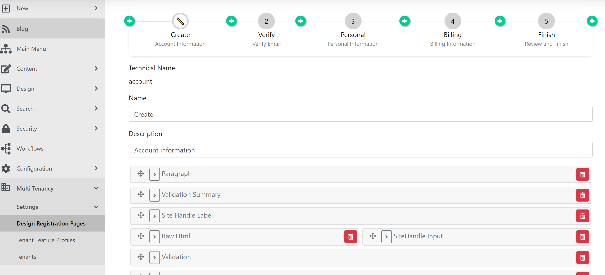

# Hosting - Surevelox.OrchardCore.Hosting

The Hosting module for [Orchard Core CMS](https://github.com/OrchardCMS/OrchardCore). The hosting module is for CMS Hosting service providers adds ability to self-service tenant registration to your Orchard Core deployment.

## Key Features

Features (Planned)
- Self-service tenant registration.
- Fully customizable multi step tenant registration pages.
- Pay Now and then provision the service later. 
- Save Payment method and charge later.
- Manual charge the tenant.
- Refund the previously charged. 

### Self-service tenant registration

### Design tenant registration pages

## Feedback
See the [open issues](https://github.com/surevelox/OrchardCore.Modules/issues) for a list of proposed features and known issues.

## Like?  Support Us.

Like the module module? Support us by sponsoring  [Surevelox @ Github](https://github.com/sponsors/surevelox).  