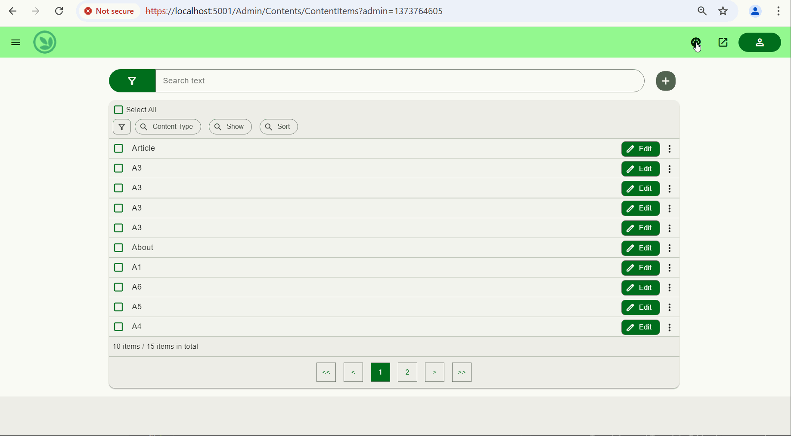
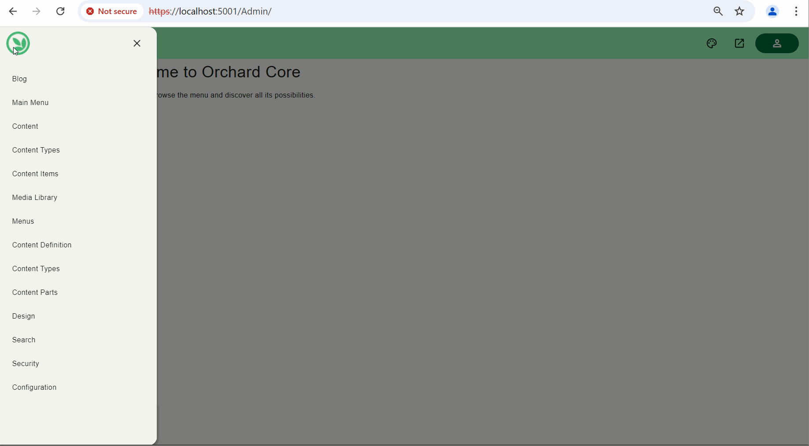
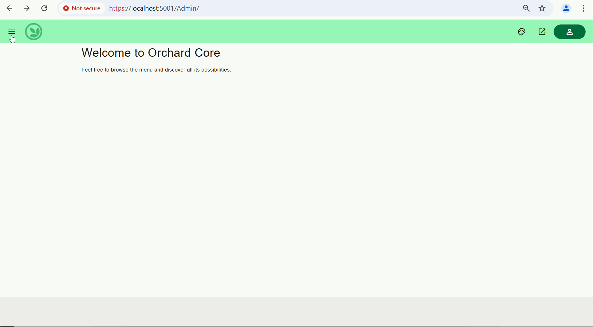
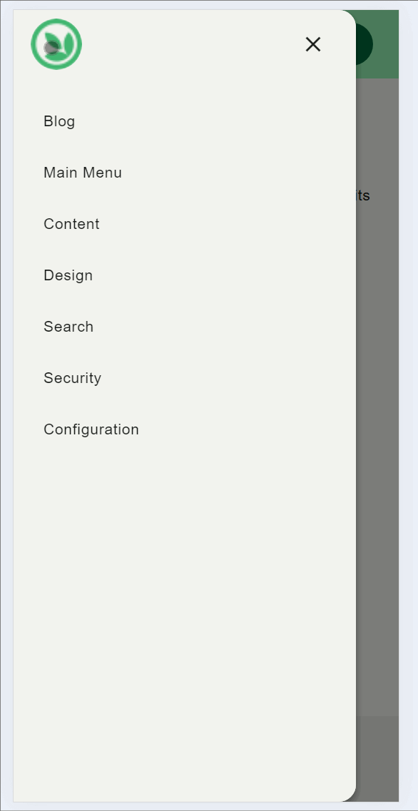

# MateAdmin - Material Design 3 Admin Theme (Coming soon)

The Admin Theme for [Orchard Core CMS](https://github.com/OrchardCMS/OrchardCore). The MateAdmin theme is based on Google's Material Design 3 principles using BeerCSS.

  

## Objectives
- Building an alternate Admin theme for Orchard Core
- Building on Open Web Standards & Adaptive UI technologies
- No JQuery / Bootstrap and No to inline scripts.
- Use of Modular javascript. 
- Seperation of concern - Seperate Server side rendering and Cient side interactivity, bridge the gap using web component technology.

## Key Features

Features (Planned)
- Multi-color theme with dynamic colors - (done)
- Site Settings - (done)
- Feature Management - (done)
- Core/Common Admin Theme and Shapes - (in progress) 
- Core/Common Web Components  - (in progress)
- Core/Common Dependencies as Reusable Web components (todo).
- Content Types and Content Field Modules (in progress)
- Security -  Users, Roles, Open Id Conenct - todo
- Email 
- Two factor authentication 
- Templates and Template Editor ( in progress)

### Dynamic Colors

Material Design 3 theme with dynamic colors. Theme colors can be defined using either preset colors, custom color picker or using image file. 

### Navigation Drawer

### Features

### Reusable Component

#### Components  

- mate-list / mate-list-item
- mate-search
- mate-filter / mate-filter-grup
- mate-theme / mate-theme-loader

# Credits / References

- [Material Design  3](https://m3.material.io/) -  Material 3 is the latest version of Google’s open-source design system.
- [Beer CSS](https://www.beercss.com/) - Build material design interfaces in record time.
- [FAST](https://github.com/microsoft/fast) - The adaptive interface system for modern web experiences.

