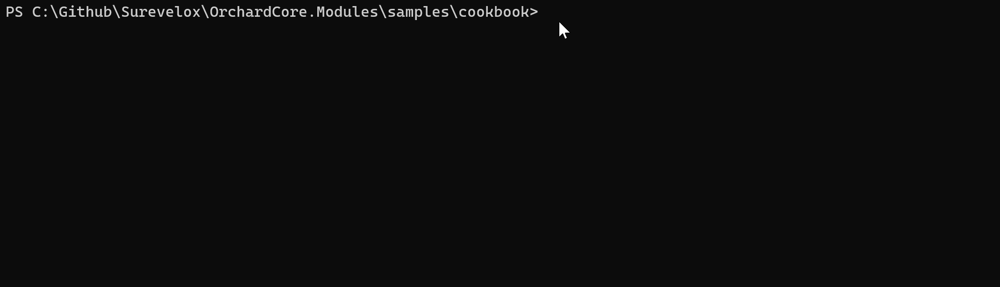
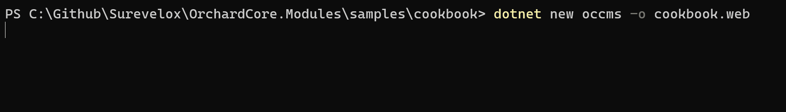
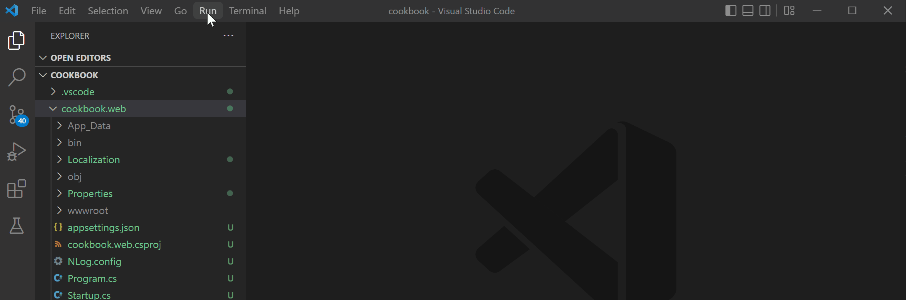
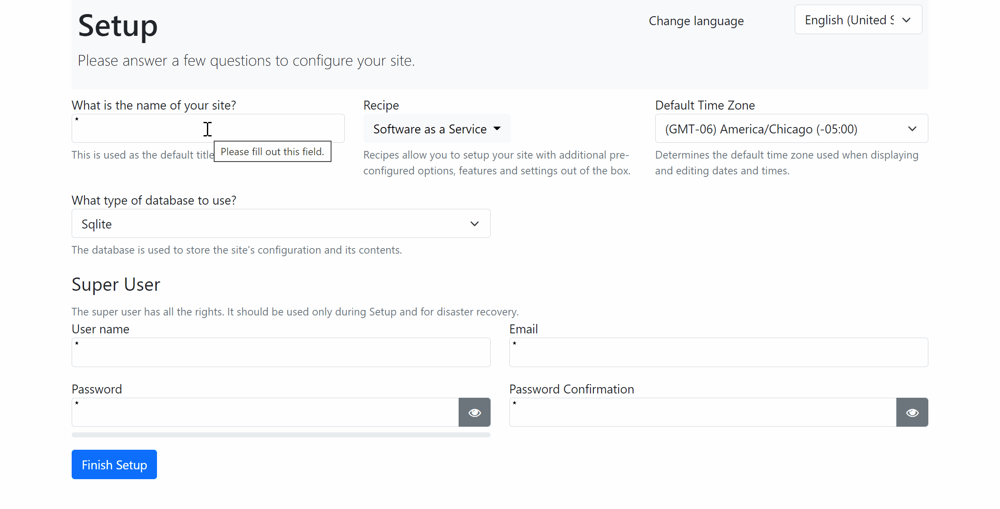
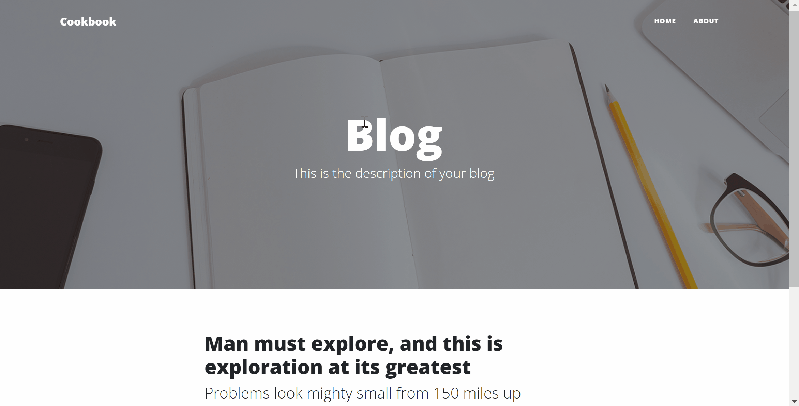

# 1. Setting up Development

## Objective

In this section we will be building the development environment and setting up ASP.NET core Orchard Core host project. We'll be also setting up the default tenant using Blog recipe.

At the end of this section you will have your project directory structure will look like following

```
cookbook (workspaceroot)
└───.vscode
│   │   launch.json
│   │   task.json
└───cookbook.web
    │   cookbook.web.csproj
    │   ...
    │   ...
    │   Program.cs
```

## Install code generation templates

If you have not already, then install latest Orchard Core code generation templates by running following command.

```dotnetcli
dotnet new -i OrchardCore.ProjectTemplates::1.4.0
```



## Create Orchard Core CMS host project

Using code generation template, create Orchard Core CMS Web App.  Use following command to create Orchard Core CMS host ASP.NET Web project. In command line open a directory where you what you place your project files. We'll call the `workspaceFolder`. In example below our `workspaceFolder` is `cookbook`

```dotnetcli
dotnet new occms -o cookbook.web
```



## Setup vscode

In your `workspaceFolder` create a directory `.vscode` and create following two files under `.vscode`

Here for our cookbook example, we'll be using `Visual Studio Code` as our development editor. However You can use editor/tooling of your choice.

- task.json
- launch.json

### task.json
Add following content to `task.json`

```json
{
    "version": "2.0.0",
    "tasks": [
        {
            "label": "build",
            "command": "dotnet",
            "type": "process",
            "args": [
                "build",
                "${workspaceFolder}/cookbook.web/cookbook.web.csproj",
                "/property:GenerateFullPaths=true",
                "/consoleloggerparameters:NoSummary"
            ],
            "problemMatcher": "$msCompile"
        },
        {
            "label": "publish",
            "command": "dotnet",
            "type": "process",
            "args": [
                "publish",
                "${workspaceFolder}/cookbook.web/cookbook.web.csproj",
                "/property:GenerateFullPaths=true",
                "/consoleloggerparameters:NoSummary"
            ],
            "problemMatcher": "$msCompile"
        },
        {
            "label": "watch",
            "command": "dotnet",
            "type": "process",
            "args": [
                "watch",
                "run",
                "--project",
                "${workspaceFolder}/cookbook.web/cookbook.web.csproj"
            ],
            "problemMatcher": "$msCompile"
        }
    ]
}
```


### launch.json
Add following content to `launch.json`

```json
{
    // Use IntelliSense to learn about possible attributes.
    // Hover to view descriptions of existing attributes.
    // For more information, visit: https://go.microsoft.com/fwlink/?linkid=830387
    "version": "0.2.0",
    "configurations": [
        {
            // Use IntelliSense to find out which attributes exist for C# debugging
            // Use hover for the description of the existing attributes
            // For further information visit https://github.com/OmniSharp/omnisharp-vscode/blob/master/debugger-launchjson.md
            "name": ".NET Core Launch (web)",
            "type": "coreclr",
            "request": "launch",
            "preLaunchTask": "build",
            // If you have changed target frameworks, make sure to update the program path.
            "program": "${workspaceFolder}/cookbook.web/bin/Debug/net6.0/cookbook.web.dll",
            "args": [],
            "cwd": "${workspaceFolder}/cookbook.web",
            "stopAtEntry": false,
            // Enable launching a web browser when ASP.NET Core starts. For more information: https://aka.ms/VSCode-CS-LaunchJson-WebBrowser
            "serverReadyAction": {
                "action": "openExternally",
                "pattern": "\\bNow listening on:\\s+(https?://\\S+)"
            },
            "env": {
                "ASPNETCORE_ENVIRONMENT": "Development"
            },
            "sourceFileMap": {
                "/Views": "${workspaceFolder}/cookbook.web/Views"
            }
        },
        {
            "name": ".NET Core Attach",
            "type": "coreclr",
            "request": "attach"
        }
    ]
}
```

## Run and setup Default Tenant

Click on `Run > Start Debugging` to run and setup your Default tenant.



If you are not using `vscode`, you can also run the project using .NET CLI `dotnet run` command.

This will launch a default browser window and will navigate to `https://localhost:5001`. If it doesn't open the browser window automatically, then you can also open your browser and navigate to `https://localhost:5001`. 

It will display setup screen as below. Here, enter required fields. For our example we are selecting `Blog` recipe. 



Once setup is complete, It will redirect to home page of the Blog site as below. Login as admin into admin dashboard and verify everything is working.



Congratulations! You have completed setting up the development environment. Continue on next section to [Add License Management](licensing).

