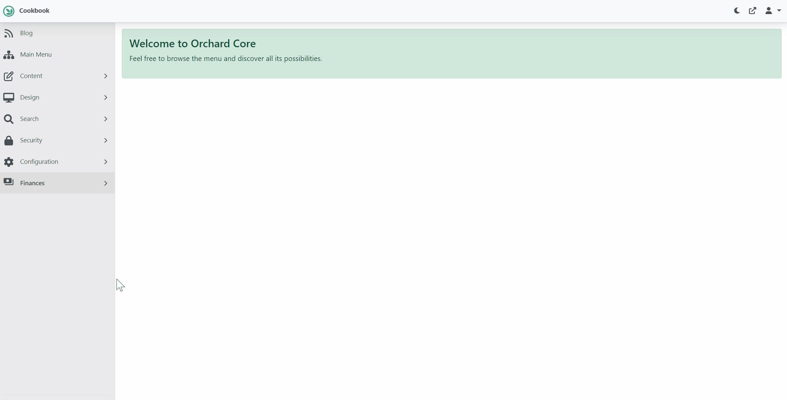

# 4. Configure Preview

## Objective

In this section we will be installing and configuring the [Device Preview Module](/modules/device-preview) and enable the `Device Preview` feature.  

Note, all of Surevelox OrchardCore Modules are dependent on [Licensing](/modules/licensing) module and requires that `License Management` feature is enabled.  If you have not already configured Licensing, follow [Add License Management](licensing) section.

At the end of this section, you will be adding the `Device Preview` module to your Orchard project and enabling the `Device Preview` feature. Finally, you will be able to Edit content and Preview content side by side in different device form factor.

## Install Device Preview

From `workspaceroot` navigate to `cookbook.web`. Using the ".net cli", add nuget package reference for Device Preview module.

Run following command to add latest version of the Device Preview Module.

```dotnetcli
cd cookbook.web
dotnet add package Surevelox.OrchardCore.DevicePreview
```
This will add the package reference to `cookbook.web.csproj`


## Enable Device Preview

Run the `cookbook.web` application. While Logged in as administrator, go to the admin dashboard. Using the navigate menu go to `Configuration > Features`. In the search box, type "device preview". Next to the `Device Preview` feature, click on Enable button to enable the feature.


This will add evaluation license in `License Manager` for the `Device Preview` feature. Verify that evaluation license is added and it is validated and not expired.



Now, Lets create a Blog Post.
- Using the left navigate menu go to `Blog`.
- On `Blog` page click on `Create Blog Post` button to create new Blog Post
- Add Blog Post content and verify that Preview is available on side, while editing the content. 


Congratulations! You have completed Configuring Preview. 

What's Next
 
- Go to next section [Design Plan and Recipes](plan-recipes). OR
- Read more about [Device Preview](/modules/device-preview)
