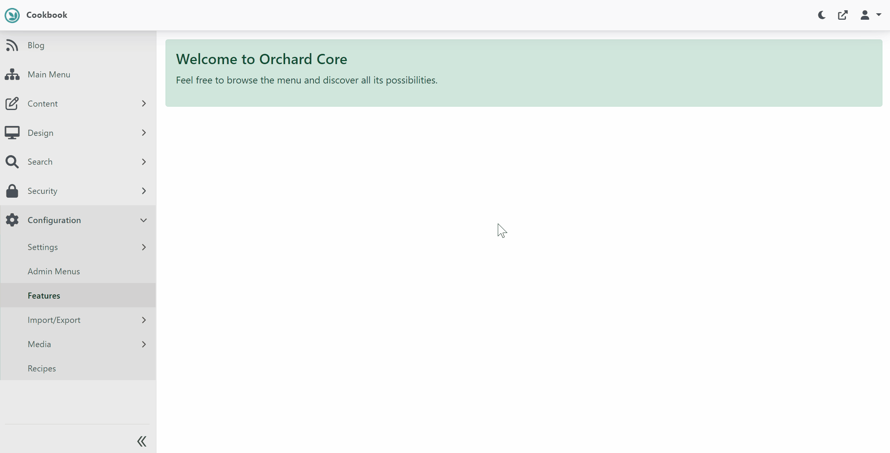
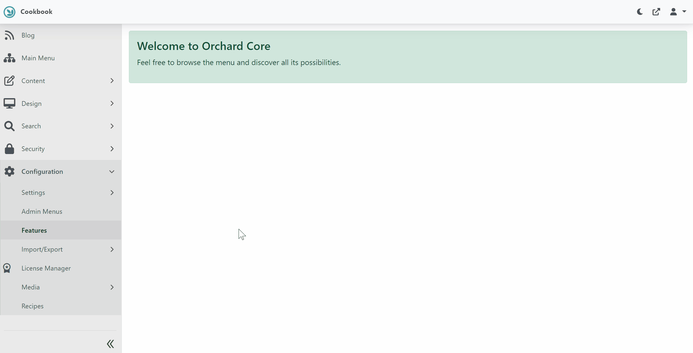

# 2. Add License Management

## Objective

In this section we will be installing the [Licensing Module](/modules/licensing) and enable the `License Management` feature.
All Surevelox OrchardCore Modules are dependent on `Licensing` and requires that `License Management` feature is enabled.

At the end of this section you will have `Licensing` module installed and have `License Management` feature enabled.

## Install Licensing

From `workspaceroot` navigate to `cookbook.web` and using .net cli install nuget package reference for licensing module.

Run following command to install latest version of Licensing Module.

```dotnetcli
cd cookbook.web
dotnet add package Surevelox.OrchardCore.Licensing
```
This will add the package reference to `cookbook.web.csproj`


## Enable License Management

Run the `cookbook.web` application, Login into admin dashboard and open `Configuration -> Features`. Search for "licensing" and Enable the `License Manager` feature.



Once enabled, you will see new menu `Configuration -> License Manager`. Click on it to verify that it's installed successfully.



Congratulations! You have completed Adding License Management. 

What's Next
 
- Go to next section [Configure Payment](Payment). OR
- Read more about [Licensing](/modules/licensing)


