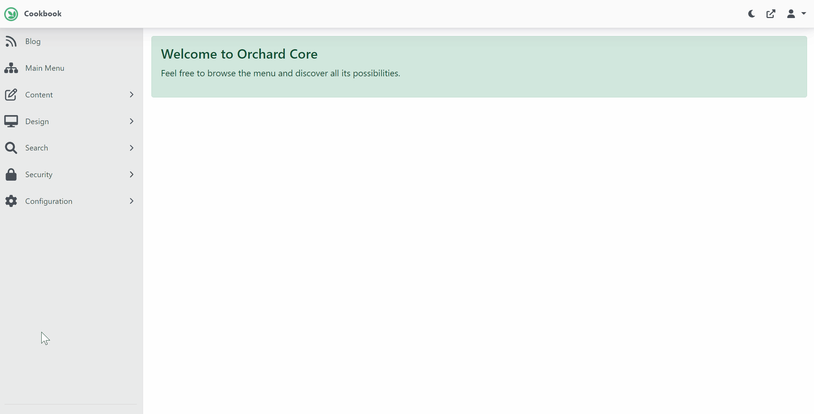
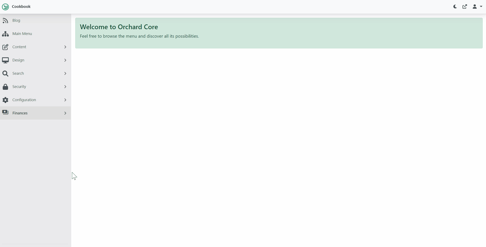
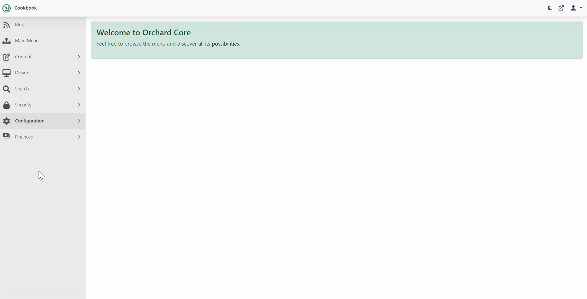

# 3. Configure Payments

## Objective

In this section we will be installing and configuring the [Payment Module](/modules/payment) and enable the `Payments` feature.  

Note, all of Surevelox OrchardCore Modules are dependent on [Licensing](/modules/licensing) module and requires that `License Management` feature is enabled.  If you have not already configured Licensing, follow [Add License Management](licensing) section.

At the end of this section, you will be adding the `Payment` module to your Orchard project and enabling the `Payments` feature. Finally, you will be able to configure your [Stripe](https://stripe.com) settings for Test and Production.

## Install Payment

From `workspaceroot` navigate to `cookbook.web`. Using the ".net cli", add nuget package reference for Payment module.

Run following command to add latest version of the Payment Module.

```dotnetcli
cd cookbook.web
dotnet add package Surevelox.OrchardCore.Payment
```
This will add the package reference to `cookbook.web.csproj`


## Enable Payments

Run the `cookbook.web` application. While Logged in as administrator, go to the admin dashboard. Using the navigate menu go to `Configuration > Features`. In the search box, type "payment". Next to the `Payments` feature, click on Enable button to enable the feature.



Once enabled, you will see new menu named `Finances`. It will also add evaluation license in `License Manager` for the `Payments` feature. Verify that evaluation license is added and it is validated and not expired.



To configure `Stripe` integration, from the menu navigate to `Finances > Payment Providers > Stripe`. Here, provide your Stripe keys.



::: tip
To get keys from [Stripe](https://stripe.com), Login into stripe dashboard and enable test mode. 
- Go to `Developers > API Key` and take Token for `Publishable key` and `Secret key`.
- Go to `Developers > Webhooks` and Click button `Test in Local Environment` and follow instruction to get Webhooks' `endpointSecret`.
:::
 


Congratulations! You have completed Configuring Payments. 

What's Next
 
- Go to next section [Design Plan and Recipes](plan-recipes). OR
- Read more about [Payment](/modules/payment)
