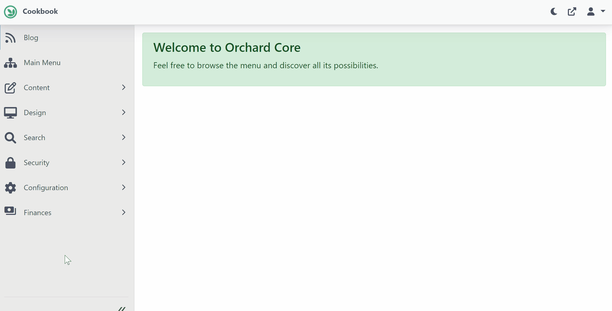
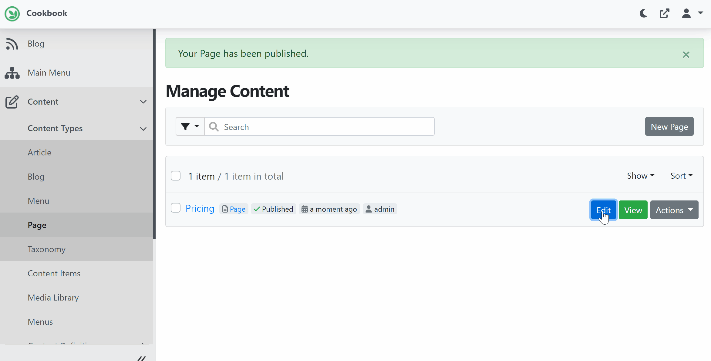
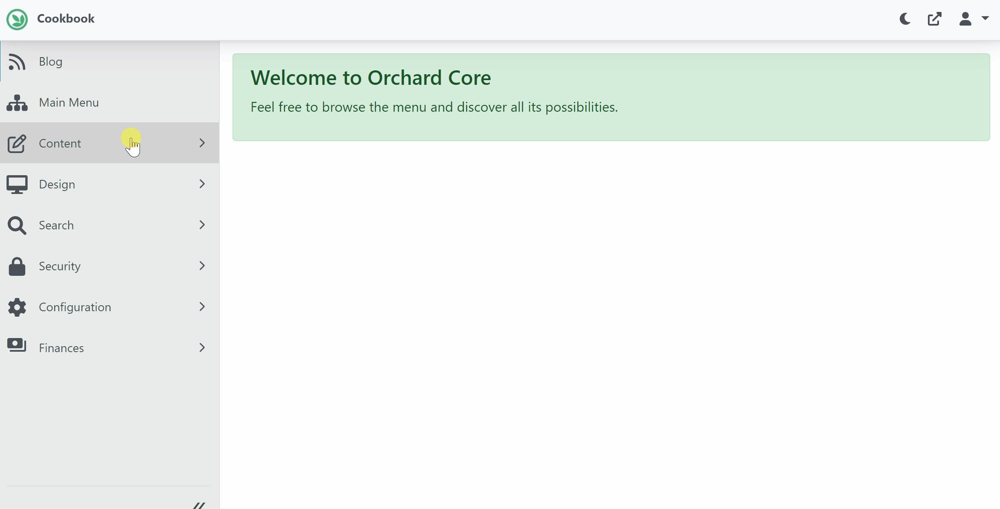

# 5. Design Plan and Recipes
## Objective

In this section we will be creating landing page for Pricing and define our Plans as following.

- Silver Plan $9.99/month
    - In this plan we'll offer all content management features, forms, workflow, templates with Comingsoon theme but without import/export.
- Gold Plan $29.99/month
    - In this plan we'll offer all content management features with Blog theme, import/export, seo,  facebook and google authentication 
- Platinum Plan $59.00/month
    - In this plan we'll offer all content management features with Agency theme, import/export, seo,  Facebook, Google, Twitter, Microsoft authentication and extra protection with 2FA.

Our prospective tenant can select one of this plan during tenant signup. 

Additionally we will creating following recipes related to each plan that will execute and setup the tenant site.

- silver.recipe.json
- gold.recipe.json
- platinum.recipe.json


## Create Pricing Page

Let's design the landing page for Pricing. 

1. Using the left navigate menu go to `Content > Page`. On `Content` list page click on `New Page` button to create new Page.
2. Enter the Title `Pricing` and click on `Add Widget` and add `Raw Html` widget.
3. In `Raw Html` add following html. 
```html
<div class="row row-cols-1 row-cols-md-3 mb-3 text-center">
   <!-- silver plan here -->
   <!-- gold plan  here-->
   <!-- platinum plan here -->
</div>
```

4. Now, lets create html for Silver plan. In `Raw Html` content replace `<!-- silver plan here -->` with following html

```html live
<div class="col">
    <div class="card mb-4 rounded-3 shadow-sm">
        <div class="card-header py-3">
			<h4 class="my-0 fw-normal">Silver Plan</h4>
        </div>
        <div class="card-body  h-100">
            <h1 class="card-title pricing-card-title">
                <span class="monthly">$11.99<small class="text-muted fw-light">/mo</small></span>
            </h1>
            <ul class="list-unstyled mt-3 mb-4">
                <li>DIY Content Management</li>
                <li>Live Preview</li>
                <li>Templates</li> 
                <li>Coming Soon Theme</li> 
                <li>Email support</li>
                <li>Help center access</li>
            </ul>
    	</div>   
        <div class="card-footer py-3">
			<a type="button" class="w-100 btn btn-lg btn-primary" href="/tenant/signup?plan=silver">Sign up for Silver</a>
		</div>
    </div>
</div>
```
<br/>

5. For Gold plan, In `Raw Html` content replace `<!-- gold plan here -->` with following html

```html live
<div class="col">
    <div class="card mb-4 rounded-3 shadow-sm">
        <div class="card-header py-3">
            <h4 class="my-0 fw-normal">Gold Plan</h4>
        </div>
        <div class="card-body h-100">
            <h1 class="card-title pricing-card-title">
                <span class="monthly">$29.99<small class="text-muted fw-light">/mo</small></span>
            </h1>
    
            <ul class="list-unstyled mt-3 mb-4">
                <li>Everything in Silver Plan, Plus</li>
                <li>Blog Theme</li> 
                <li>Import/Export Content</li>
                <li>SEO, Facebook and Google Authentication </li>
            </ul>
        </div>
        <div class="card-footer py-3">
            <a class="w-100 btn btn-lg btn-primary" href="/tenant/signup?plan=gold">Sign up for Gold</a>
		</div>
    </div>
</div>

```
<br/>

6. For Platinum plan, In `Raw Html` content replace `<!-- platinum plan here -->` with following html

```html live
<div class="col">
    <div class="card mb-4 rounded-3 shadow-sm">
        <div class="card-header py-3">
        <h4 class="my-0 fw-normal">Platinum Plan</h4>
        </div>
        <div class="card-body h-100">
            <h1 class="card-title pricing-card-title">
                <span class="monthly">$59.99<small class="text-muted fw-light">/mo</small></span>
            </h1>
            <ul class="list-unstyled mt-3 mb-4">
                <li>Everyting in Gold Plan, Plus</li>
                <li>Agency Theme</li> 
                <li>Forms and Workflow</li>
                <li>Twitter, Github and Microsoft</li>
                <li>Two factor Auth</li>
                <li>Admin Templates</li>
            </ul>
        </div>
	    <div class="card-footer py-3">
            <a class="w-100 btn btn-lg btn-primary" href="/tenant/signup?plan=platinum">Sign up for Platinum</a>
		</div>
    </div>
</div>
``` 
<br/>
Click on Publish to Publish the Page.

<br/>



<br/>

7. To create feature comparison table add another `Raw Html` widget and add following content

``` html live
<div class="table-responsive flex-grow-1">
	  <table class="table text-center">
		<thead>
		  <tr>
			<th style="width: 34%;"></th>
			<th style="width: 22%;">Silver</th>
			<th style="width: 22%;">Gold</th>
			<th style="width: 22%;">Platinum</th>
		  </tr>
		</thead>
		<tbody>
		  <tr>
			<th scope="row" class="text-start">DIY Content Management</th>
			<td><i class="fa-solid fa-check"></i></td>
			<td><i class="fa-solid fa-check"></i></td>
			<td><i class="fa-solid fa-check"></i></td>
		  </tr>
		  <tr>
			<th scope="row" class="text-start">Live Preview</th>
			<td><i class="fa-solid fa-check"></i></td>
			<td><i class="fa-solid fa-check"></i></td>
			<td><i class="fa-solid fa-check"></i></td>
		  </tr>
        <tr>
			<th scope="row" class="text-start">Import/Export Contents </th>
			<td></td>
			<td><i class="fa-solid fa-check"></i></td>
			<td><i class="fa-solid fa-check"></i></td>
		  </tr>
		  
        <tr>
			<th scope="row" class="text-start">SEO</th>
			<td></td>
			<td><i class="fa-solid fa-check"></i></td>
			<td><i class="fa-solid fa-check"></i></td>
		  </tr>
        	
          <tr>
			<th scope="row" class="text-start">Forms</th>
			<td><i class="fa-solid fa-check"></i></td>
			<td><i class="fa-solid fa-check"></i></td>
			<td><i class="fa-solid fa-check"></i></td>
		  </tr>
		  <tr>
			<th scope="row" class="text-start">Workflow</th>
			<td><i class="fa-solid fa-check"></i></td>
			<td><i class="fa-solid fa-check"></i></td>
			<td><i class="fa-solid fa-check"></i></td>
		  </tr>    
		</tbody>

		<tbody>
		  <tr>
			<th scope="row" class="text-start">Comming Soon Theme</th>
            <td><i class="fa-solid fa-check"></i></td>
			<td></td>
			<td></td>
		  </tr>

		  <tr>
			<th scope="row" class="text-start">Blog Theme</th>
            <td></td>
			<td><i class="fa-solid fa-check"></i></td>
			<td></td>
		  </tr>
          <tr>
			<th scope="row" class="text-start">Agency Theme</th>
            <td></td>
			<td></td>
			<td><i class="fa-solid fa-check"></i></td>
		  </tr>
		  <tr>
			<th scope="row" class="text-start">Templates</th>
			<td><i class="fa-solid fa-check"></i></td>
			<td><i class="fa-solid fa-check"></i></td>
			<td><i class="fa-solid fa-check"></i></td>
		  </tr>
          <tr>
			<th scope="row" class="text-start">Admin Templates</th>
			<td></td>
			<td></td>
			<td><i class="fa-solid fa-check"></i></td>
		  </tr>
		</tbody>

        <tbody>
		  <tr>
			<th scope="row" class="text-start">Facebook Authentication</th>
			<td></td>
			<td><i class="fa-solid fa-check"></i></td>
			<td><i class="fa-solid fa-check"></i></td>
		  </tr>
           <tr>
			<th scope="row" class="text-start">Google Authentication</th>
			<td></td>
			<td><i class="fa-solid fa-check"></i></td>
			<td><i class="fa-solid fa-check"></i></td>
		  </tr>
	       <tr>
			<th scope="row" class="text-start">Github Authentication</th>
			<td></td>
			<td></td>
			<td><i class="fa-solid fa-check"></i></td>
		  </tr>
          <tr>
			<th scope="row" class="text-start">Microsoft Authentication</th>
			<td></td>
			<td></td>
			<td><i class="fa-solid fa-check"></i></td>
		  </tr>
          <tr>
			<th scope="row" class="text-start">Twitter Authentication</th>
			<td></td>
			<td></td>
			<td><i class="fa-solid fa-check"></i></td>
		  </tr>
		  <tr>
			<th scope="row" class="text-start">Extra security (2FA/MFA) </th>
			<td></td>
			<td></td>
			<td><i class="fa-solid fa-check"></i></td>
		  </tr>
		</tbody>
        <tbody>
		  <tr>
			<th scope="row" class="text-start">Email support</th>
			<td><i class="fa-solid fa-check"></i></td>
			<td><i class="fa-solid fa-check"></i></td>
			<td><i class="fa-solid fa-check"></i></td>
		  </tr>
           <tr>
			<th scope="row" class="text-start">Help center access</th>
			<td><i class="fa-solid fa-check"></i></td>
			<td><i class="fa-solid fa-check"></i></td>
			<td><i class="fa-solid fa-check"></i></td>
		  </tr>
	    
        </tbody>
	  </table>
	</div>
```

Finally click on Publish to Publish the Page.

 


## Add to Main Menu

After publishing the `Pricing page`, next step is to add it's link to the Main Menu. While Logged in as administrator, go to the admin dashboard, Using the navigate menu go to `Content > Menus`. 

In the Menu list page, Look for `Main Menu` and click on Edit button.

On `Edit Menu` page, click on `Add Menu Item` and add `Content Menu Item`.

Give it a name `Pricing`, and select the Content Item `Pricing` and Publish. 

 

 

## Recipes 

### Create silver.recipe.json

From `workspaceroot` navigate to `cookbook.web` directory. Create a directory `Recipes`. Inside `Recipes` directory, create `silver.recipe.json`file. Add following recipe content.

- This Recipe will create ComingSoon site.
- Enable Licensing and DevicePreview modules.
- Disable `Deployment` feature.

```json
{

  "name": "silver",
  "displayName": "Silver Plan",
  "description": "Recipe for Silver Plan",
  "author": "Surevelox Inc",
  "website": "https://www.surevelox.com",
  "version": "1.0",
  "issetuprecipe": "true",
  "categories": [ "Content Management" ],
  "tags": [ "plan", "hidden" ],
  "variables": {

  },
  "steps": [
    {
      "name": "recipes",
      "Values": [
        {
          "executionid": "comingsoon001",
          "name": "ComingSoon"
        }
      ]
    },
    {
      "name": "feature",
      "enable": [

        "Surevelox.OrchardCore.Licensing",
        "Surevelox.OrchardCore.DevicePreview"
      ],
      "disable": [
        "OrchardCore.Deployment"
      ]
    }
  ]
}

```

### Create gold.recipe.json

 Create `gold.recipe.json`file and Add following recipe content.

- This Recipe will create Blog site.
- Enable Licensing and DevicePreview modules.

```json
{
  "name": "gold",
  "displayName": "Gold Plan",
  "description": "Recipe for Gold Plan",
  "author": "Surevelox Inc",
  "website": "https://www.surevelox.com",
  "version": "1.0",
  "issetuprecipe": "true",
  "categories": [ "Content Management" ],
  "tags": [ "plan", "hidden" ],
  "variables": {

  },
  "steps": [
    {
      "name": "recipes",
      "Values": [
        {
          "executionid": "blog001",
          "name": "Blog"
        }
      ]
    },
    {
      "name": "feature",
      "enable": [
        "Surevelox.OrchardCore.Licensing",
        "Surevelox.OrchardCore.DevicePreview",
        "OrchardCore.Facebook",
        "OrchardCore.Facebook.Login",
        "OrchardCore.Google.GoogleAuthentication",
        "OrchardCore.Seo"
      ]
    }
  ]
}
```

### Create platinum.recipe.json

 Create `platinum.recipe.json`file and Add following recipe content.

- This Recipe will create Agency site.
- Enable Licensing and DevicePreview, TwoFactorAuth modules.
- Enable Facebook,s Google, Microsoft, Github, Twitter Authentication
- Enable Seo, Admin Templates.

```json
{
  "name": "platinum",
  "displayName": "Platinum Plan",
  "description": "Recipe for Platinum Plan",
  "author": "Surevelox Inc",
  "website": "https://www.surevelox.com",
  "version": "1.0",
  "issetuprecipe": "true",
  "categories": [ "Content Management" ],
  "tags": [ "plan", "hidden" ],
  "variables": {
  },
  "steps": [
    {
      "name": "recipes",
      "Values": [
        {
          "executionid": "agency001",
          "name": "Agency"
        }
      ]
    },
    {
      "name": "feature",
      "enable": [
        "Surevelox.OrchardCore.Licensing",
        "Surevelox.OrchardCore.DevicePreview",
        "Surevelox.OrchardCore.TwoFactorAuth",
        "OrchardCore.AdminTemplates",
        "OrchardCore.Facebook",
        "OrchardCore.Facebook.Login",
        "OrchardCore.Google.GoogleAuthentication",
        "OrchardCore.Seo",
        "OrchardCore.Microsoft.Authentication.MicrosoftAccount",
        "OrchardCore.Microsoft.Authentication.AzureAD",
        "OrchardCore.GitHub.Authentication",
        "OrchardCore.Twitter",
        "OrchardCore.Twitter.Signin"
      ]
    }
  ]
}
```


Congratulations! You have completed designing Plans and Recipes.

What's Next

Go to next section [Design Tenant Registration](./tenant-registration.md).

