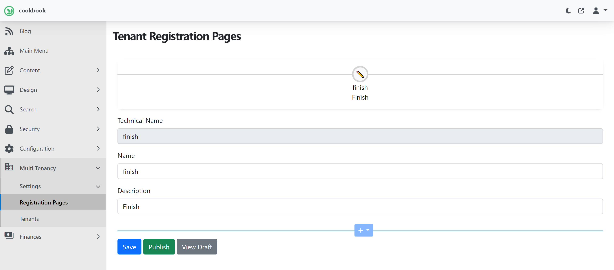

# 6. Design Tenant Registration


## Objective

In this section we will be installing and configuring the [Hosting Module](/modules/hosting) and enable the `Tenant Registration` feature.  


At the end of this section,  you will be adding the `Hosting` module to your Orchard project and enabling the `Tenant Registration` feature. Finally, a website users will be able to select the plan and sign-up for a website by providing their basic information like email and contact details in series of step pages. At the end of the sign-up process user gain access to the app.


:::warning Prerequisite
Note, all of Surevelox OrchardCore Modules are dependent on [Licensing](/modules/licensing) module and requires that `License Management` feature is enabled.  If you have not already configured Licensing, follow [Add License Management](licensing) section.
:::

## Install Hosting

From `workspaceroot` navigate to `cookbook.web`. Using the ".net cli", add nuget package reference for Hosting module.

Run following command to add latest version of the Hosting Module.

```dotnetcli
cd cookbook.web
dotnet add package Surevelox.OrchardCore.Hosting
```
This will add the package reference to `cookbook.web.csproj`


## Enable Tenant Registration

Run the `cookbook.web` application. While Logged in as administrator, go to the admin dashboard. Using the navigate menu go to `Configuration > Features`. In the search box, type "tenant registration". Next to the `Tenant Registration` feature, click on Enable button to enable the feature.


:::tip Evaluation License
 It will also add evaluation license in `License Manager` for the `Tenant Registration` feature. Verify that evaluation license is added and it is validated and not expired.
:::


Once enabled, you will see new menu named `Multi Tenancy`. It will add out-of-the-box Tenant Registration Pages with one step "Finish". It will also add `Quick Start Recipes`. 



To configure `Registration Pages`, from the menu navigate to `Multi Tenancy > Settings > Registration Pages`. Here, the pages and registration flow can be customized.

Lets checkout tenant registration pages available out-of-box. To add out-of-the-box tenant registration flow from recipe, navigate to `Configuration > Recipes`. On the `Recipes` page, under `Hosting` heading, select and run recipe `Quick Start: Tenant Registration Pages (No payments)`.


The successful execution of the recipe will create registration pages as below screenshot.

:::tip Missing Core widgets?
If your `Default` tenant is setup using SaaS recipe or any other setup recipe that dot not have core widgets content types like HTML, Liquid. Then you can create them by running recipe `Core Widgets`.
:::


There are total four steps created by recipe`Quick Start: Tenant Registration Pages (No payments)`. Each step provides customizable flow widgets. The registration steps can be customized by adding/removing widgets and/or adding/removing steps.

- Account
    - Captures site details and admin credentials, admin's email and RecipeName from query string. 
- Verify
    - Verifies the email address provided in Account Step.(**Note**: This steps sends verification code via Email and requires that you have email settings are configured properly.)
- Personal
    - Captures personal details like First Name, Last Name, Contact Details. 
- Finish (Review)
    - Review and Finish 

More steps can be added by clicking (+) Icon or steps can be deleted to customize sign up flow.

Now, let's verify verify How end-user will sign-up by selecting a plan, follow sign-up process and provision their tenant.

 While application is running, navigate to `Pricing` page, select the plan and follow signup process.


Congratulations! You have added tenant sign-up process in your website and tenant provisioning according to selected plan,

What's Next

Go to next section [Design Tenant Billing](./tenant-billing.md).
